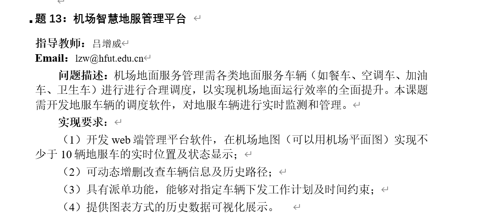

# 课设要求

## 地图中心点（浦东国际机场）

经纬度：121.818569,31.140732

放大倍率：18

## 车辆位置

- 加油车：121.815191,31.141428
- 餐车：121.813485,31.139689
- 空调车：121.814042,31.147431
- 行政车：121.811508,31.147585
- 急救车：121.821282,31.144278

## 注意点

1. 百度地图z-index = 9
2. addEventListener自解除需要用函数表达式而不是匿名函数
3. dom.style.att中只可以取到定义在元素标签上的或者由js写入的style属性，通过css定义的属性则取不到！！！

